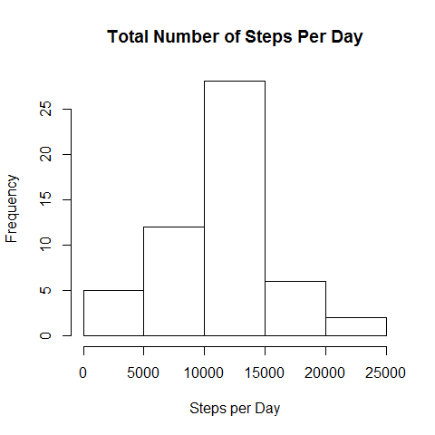
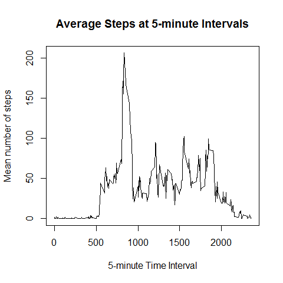
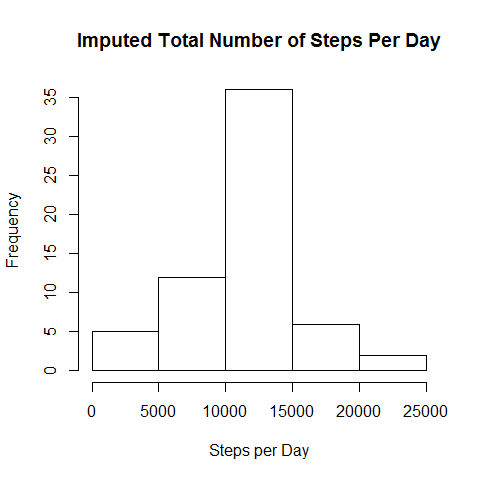
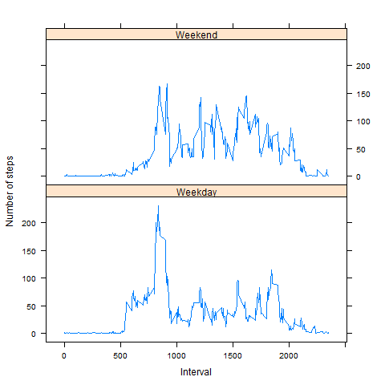

# Reproducible Research: Peer Assessment 1


## Loading and preprocessing the data
```{r}
activity=read.csv("activity.csv")
```

## What is mean total number of steps taken per day?
```{r}
totalstepsPD <- tapply(activity$steps, activity$date,sum)
```

1.Make a histogram of the total number of steps taken each day
```{r}
hist(totalstepsPD,xlab="Steps per Day", main="Total Number of Steps Per Day")
```
 

2.Calculate the mean and median total number of steps taken per day

```{r}
mean(totalstepsPD,na.rm=TRUE)
median(totalstepsPD,na.rm=TRUE)
```
The mean   of total number steps taken per day is 10766.19

The median of total number steps taken per day is 10765


## What is the average daily activity pattern?
1.Make a time series plot(i.e. type = "l") of the 5-minute interval (x-axis) and the average number of steps taken, averaged across all days (y-axis)
```{r}
steps_interval<-aggregate(steps~interval,data=activity,mean,na.rm=TRUE)
plot(steps_interval,
     xlab="5-minute Time Interval",
     ylab="Mean number of steps",
     main="Average Steps at 5-minute Intervals",
     type="l")
```
 

2.Which 5-minute interval, on average across all the days in the dataset, contains the maximum number of steps?
```{r}
steps_interval[which.max(steps_interval$steps),]$interval
```
The 5-minute interval, containing the maximum number of steps, is 835.

## Imputing missing values
Note that there are a number of days/intervals where there are missing values (coded as NA). The presence of missing days may introduce bias into some calculations or summaries of the data.

1.Calculate and report the total number of missing values in the dataset (i.e. the total number of rows with NAs)
```{r}
sum(is.na(activity$steps))
```
The total number of NAs in the dataset is 2304.

2.Devise a strategy for filling in all of the missing values in the dataset. The strategy does not need to be sophisticated. For example, you could use the mean/median for that day, or the mean for that 5-minute interval, etc.
```{r}
# use the mean interval to substitute NAs
fillinNA<-function(x){
    steps_interval[steps_interval$interval==x,]$steps
}
```

3.Create a new dataset that is equal to the original dataset but with the missing data filled in.
```{r}
# create new dataset
activity_new <- activity
# fill in the NAs in new dataset
for(i in 1:nrow(activity_new)){
    if(is.na(activity_new[i,]$steps)){
        activity_new[i,]$steps<-fillinNA(activity_new[i,]$interval)
    }
}
# check if NAs in new dataset equals 0.
sum(is.na(activity_new))
```

4.Make a histogram of the total number of steps taken each day and Calculate and report the mean and median total number of steps taken per day. Do these values differ from the estimates from the first part of the assignment? What is the impact of imputing missing data on the estimates of the total daily number of steps?
```{r}
totalstepsPD_new <- tapply(activity_new$steps, activity_new$date,sum)
hist(totalstepsPD_new,
     xlab="Steps per Day", 
     main="Imputed Total Number of Steps Per Day")
```
 

Calculate and report the mean and median total number steps taken per day.

```{r}
mean(totalstepsPD_new,na.rm=TRUE)
median(totalstepsPD_new,na.rm=TRUE)
```
The mean   of imputed dataset is 10766.19 (the same as previous one.)

The median of imputed dataset is 10766.19 (slightly differs from before-imputation.)

## Are there differences in activity patterns between weekdays and weekends?
For this part the weekdays() function may be of some help here. Use the dataset with the filled-in missing values for this part.

1.Create a new factor variable in the dataset with two levels -- "weekday" and "weekend" indicating whether a given date is a weekday or weekend day.
```{r}
Sys.setlocale("LC_TIME", "English")
activity_new$date <- as.Date(activity_new$date,"%Y-%m-%d")
day <- weekdays(activity_new$date)
activity_new$day_type <- ifelse(day == "Saturday" | day == "Sunday",
                                "Weekend", "Weekday")
mean_new <- aggregate(activity_new$steps,
                      by=list(activity_new$interval,
                              activity_new$day_type),
                      mean)
names(mean_new) <- c("interval","day_type","steps")
```

2.Make a panel plot containing a time series plot (i.e. type = "l") of the 5-minute interval (x-axis) and the average number of steps taken, averaged across all weekday days or weekend days (y-axis).
```{r}
# make panel plot
library("lattice")
panel <- xyplot(steps~interval | day_type, 
                data=mean_new,
                layout=c(1,2),
                xlab="Interval",
                ylab = "Number of steps",
                type="l")

# show and save plot
show(panel)
png(filename = 'panel_plot.png', width=480, height=480)
plot(panel)
dev.off()
```
 

